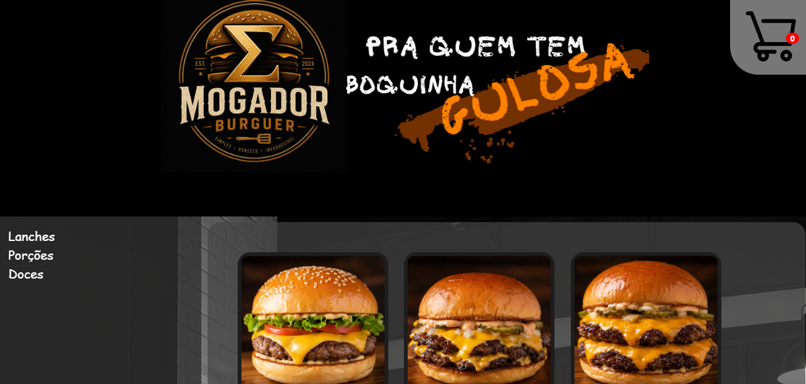
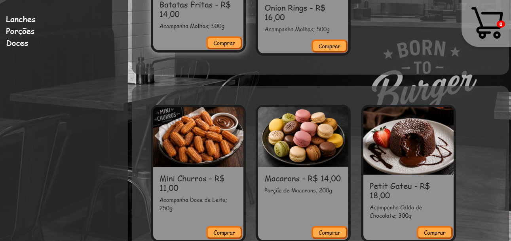
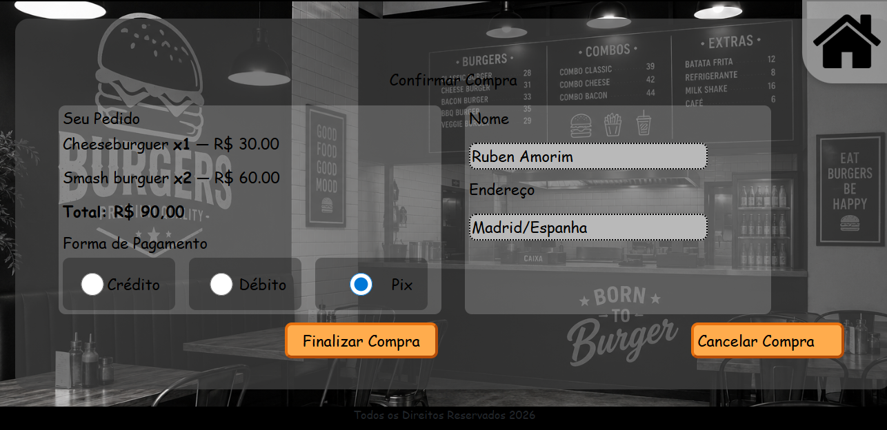

# 🍔Mogador Burguer - Site de Hamburgueria🍔

Site desenvolvido com FrameWork Flask, Hospedado na AWS. Sistema permite que o usuario escolha, enytre os itens do menu, quais lanches quer adicionar ao carrinho. Podendo ter uma demostração da ação de finalizar a compra

## Tecnologias Usada:

- HTML/CSS;
- JavaScript;
- Python;
- Flask;
- MySql;
- AWS - EC2;
- Docker;

## Funcionamento

Na página inicial de Menu, o clienten pode escolher quais itens quer comprar ao clicar no botão "comprar". Essa ação adiciona o produto ao carrinho e aparecerá no icone de carrinho, no canto superior direito, quanto itens você já adicionou.
Para finalizar a compra, clique no botão de carrinho que leva a página de compra. Na página em questão será pedido seu nome, endereço e meio de pagamento, junto ao seu pedido e valor total. Caso haja erros, clique em cancelar, contrário, clique em finalizar compra.

## Demostração do Visual do Site





## Estrutura de Páginas

```text
Projeto-Hamburgueria/
├── Fotos/
│ 
├── static/
│   ├── css/
│   │   ├── style.css
│   │   └── carrinho.css
│   ├── imagens/
│   └── script/
│       └── script.js
├── templates/
│   ├── style.css
│   └── carrinho.css
│ 
├── app.py
├── dockerfile
├── docker-compose.yml
├── hamburgueria.sql
├── requirements.txt
├── README.md
└── .gitignore
```

## Instalação

1. Clone o repositório

```bash
git clone https://github.com/RafaelMioniC/mogadorburguer-hamburgueria.git
cd projeto-hamburgueria
```

2. Inicie a aplicação:

```bash
docker compose up --build
```

3. Acesse:

```
http://localhost:5000
```

Para parar a aplicação:

```bash
docker compose down
```